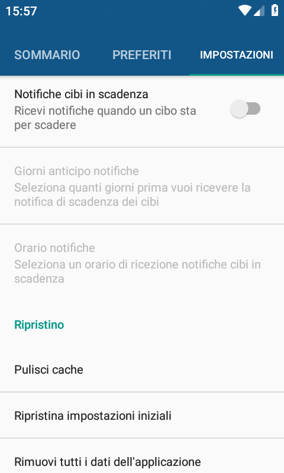
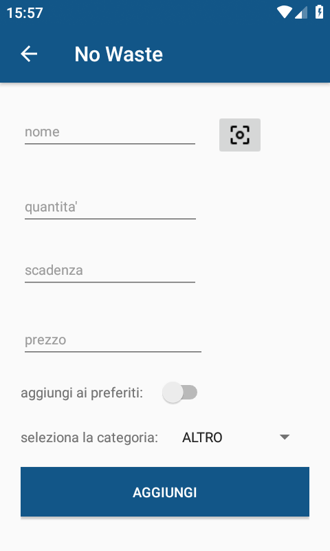
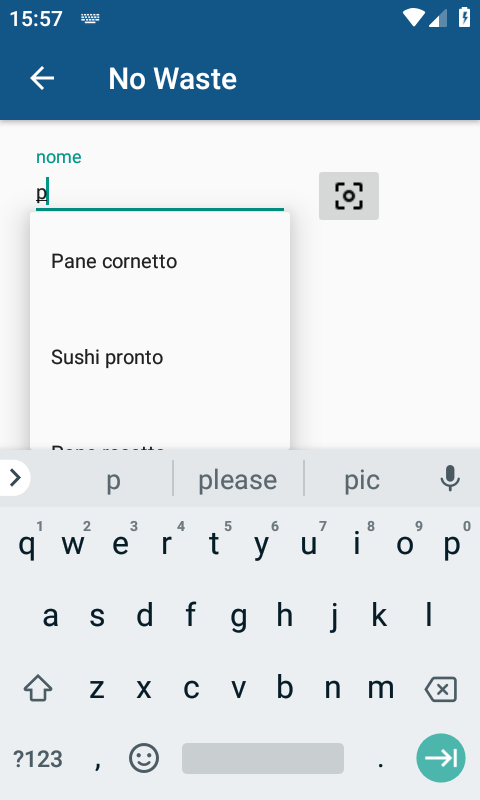
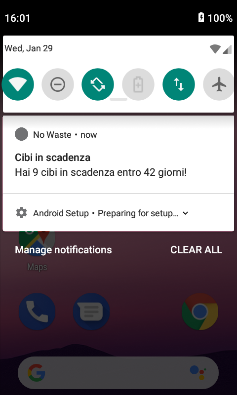
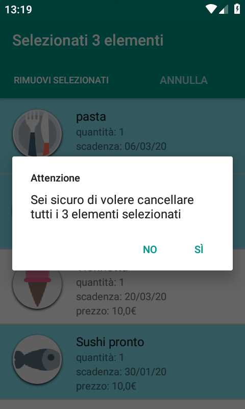
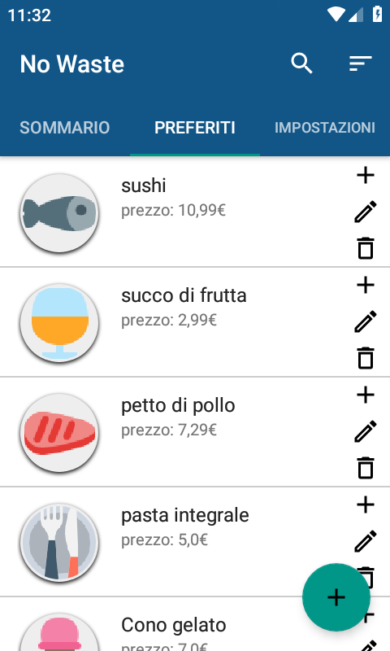
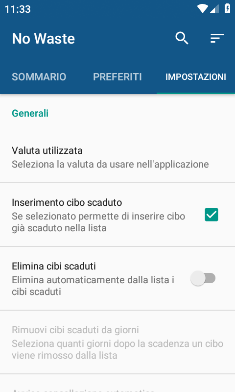

# progetto-corso-app-mobile
Progetto sviluppato per il corso di "design di mobile applications" durante il percorso di laurea magistrale in informatica.   
Di seguito è riportata una breve descrizione della richiesta del progetto, per avere informazioni più complete sia riguardo la consegna sia riguardo la soluzione proposta si veda il [report](report.pdf) relativo.

## Descrizione
L'obiettivo è quello di partire da un'idea di applicazione mobile e di applicare varie tecniche apprese durante il corso al fine di fare l'analisi, il design e l'implementazione dell'app.

## Screenshots

